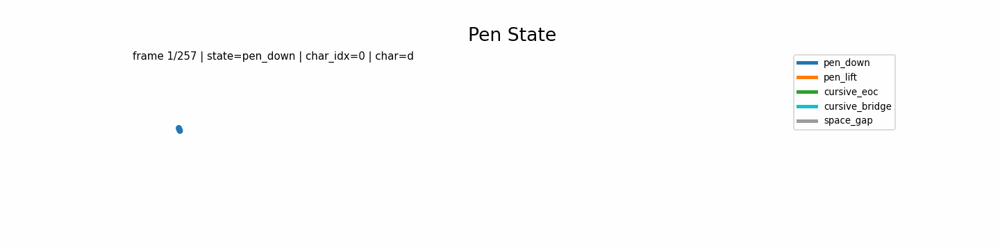
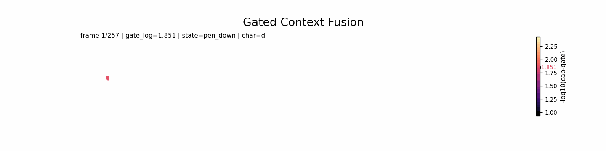

# CASHG

This repository is maintained with the `ENGLISH_MERGING` training pipeline.
The default training config in this repository is `configs/English_MERGING_SENT_512dim_tokenwise.yml`.
The official workflow is:

1. Prepare and refine the dataset.
2. Run ENGLISH_MERGING training.

## Demo

`assets/gifs/main_pen_state_animation.gif` shows pen-state transitions over generated trajectories.



`assets/gifs/main_gated_context_fusion_animation.gif` shows how gated context fusion affects character generation over time.



## 1. Environment

```bash
conda env create -f environment.yml
conda activate CASHG
```

If the environment already exists:

```bash
conda env update -f environment.yml --prune
```

## 2. Dataset Refinement

### 2.1 Expected Layout

```text
dataset/EN/IAM/
  lineStrokes-all.tar.gz
  converted/
dataset/EN/BRUSH/
dataset/EN/merging_char_pickles/
dataset/EN/merging_sent_pickles/
dataset/EN/merging_style_pickles/
```

### 2.2 Convert IAM Strokes To JSON

`src/preprocessing/merging_handwriting_dataset_generator.py` can trigger IAM conversion automatically when `dataset/EN/IAM/converted/` is missing.
Manual conversion command:

```bash
cd src/preprocessing/IAM_segmentation_GT
python convert_gt.py \
  -d ../../../dataset/EN/IAM/lineStrokes-all.tar.gz \
  -s trainset_segmented.json testset_v_segmented.json testset_t_segmented.json testset_f_segmented.json \
  -o ../../../dataset/EN/IAM/converted
```

If required by your setup, add the `data_preparation/` package under:

```text
src/preprocessing/IAM_segmentation_GT/data_preparation/
```

### 2.3 Build Merged Pickles

This generates char/sentence/style pickles from IAM + BRUSH with merged writer IDs.

```bash
python -m src.preprocessing.merging_handwriting_dataset_generator \
  --iam_root dataset/EN/IAM/converted \
  --brush_root dataset/EN/BRUSH \
  --save_char_root dataset/EN/merging_char_pickles \
  --save_sent_root dataset/EN/merging_sent_pickles \
  --save_style_root dataset/EN/merging_style_pickles \
  --img_size 64 64 \
  --resample_type original \
  --rdp_epsilon_normalized 0.006 \
  --deskew_angle_threshold 2.0 \
  --deskew_max_angle 45.0
```

Optional controls:

- `--rdp_visualize`
- `--deskew_visualize`
- `--max_iam_writers N`
- `--max_brush_writers N`
- `--no_deskew`
- `--max_traj_len N`

## 3. Training Order

### 3.1 Resume Or Fresh Start

Current config resume checkpoint:

```text
saved/eng/train_handwriting_generator/2026-02-20_12-42-12/checkpoints/ckpt_615000.pt
```

For a fresh run from step `0`, set:

```yaml
SAVE:
  RESUME_PATH: null
```

`RESUME_PATH` restores optimizer and iteration state.
`START_PATH` only initializes model weights.

### 3.2 Launch Training

Single GPU:

```bash
python train.py --config configs/English_MERGING_SENT_512dim_tokenwise.yml
```

Multi GPU:

```bash
CUDA_VISIBLE_DEVICES=0,1 torchrun --nproc_per_node=2 --master_port=29502 \
  train.py --config configs/English_MERGING_SENT_512dim_tokenwise.yml
```

### 3.3 Outputs

Outputs are written to:

```text
saved/eng/train_handwriting_generator/
```

Run directories contain checkpoints and TensorBoard logs.
